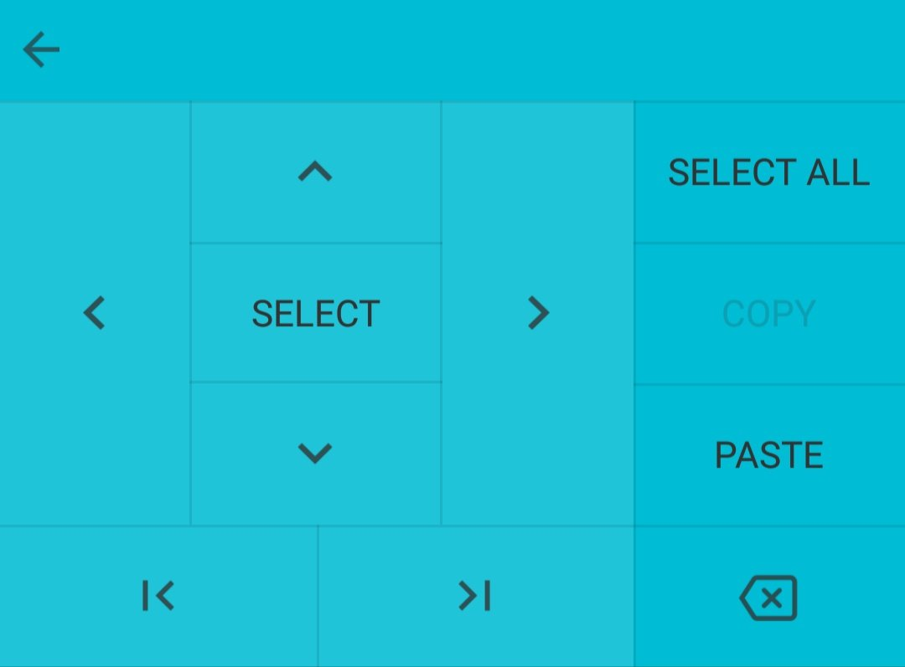

Apakah kamu salah satu dari satu miliar pengguna Android yang menggunakan Gboard? Mungkin kamu bahkan tidak tahu nama aplikasi keyboard di ponselmu, karena sudah terpasang begitu saja sejak awal. Kemungkinan, keyboardmu adalah Gboard. Saya juga pakai Gboard karena sudah terpasang sejak awal di smartphone saya. Untungnya, Gboard punya tampilan yang elegan dan banyak fitur yang bisa dioptimalkan sesuai cara mengetik kita.

Ketika menjelajahi fitur-fitur Gboard, saya menemukan bahwa ternyata banyak juga hal-hal yang bisa dilakukan dengan Gboard, juga fitur-fitur yang menunjang produktivitas. Karena itu, saya ingin berbagi beberapa fitur dan trik yang saya temukan:

1. **_Gestures_**
    - **Menggeser kursor**: Setelah mengetik kalimat panjang dan ada salah ketik di tengah-tengah, mencoba menempatkan kursor tepat di tempat salah ketik tidak selalu mudah. Ibu jari kita yang jauh lebih besar daripada tulisan di layar, butuh beberapa kali mencoba sampai kursor jatuh pada tempat yang tepat. Cara yang lebih mudah adalah tekan saja sekenanya agar kursor berpindah dekat tempat yang diinginkan, lalu geser kursor ke tempat yang tepat dengan cara menempatkan jari di tombol spasi dan geser ke kanan atau kiri. Kursor akan bergeser mengikuti gerakan jari, seperti saat kita menggerakkan kursor di laptop menggunakan papan sentuh (_touchpad_). Dengan begitu, menempatkan kursor di tempat yang presisi bisa jauh lebih mudah.
    - **Menghapus beberapa kata sekaligus**: Menghapus satu karakter cukup dilakukan dengan menekan tombol hapus (_backspace_). Tapi bagaimana kalau ingin menghapus empat kata? Lelah juga, kan, kalau harus menekan tombol hapus dua puluh kali? Cara yang lebih cepat adalah dengan menekan tombol hapus lalu _swipe_ ke kiri. Setiap kali _swipe_, satu kata terhapus sekaligus, tidak hanya satu karakter. Dengan begitu menghapus empat kata bisa dilakukan dengan hanya _swipe_ empat kali dari tombol _backspace_.
2. **_Penerjemahan langsung dalam keyboard_**
    Ketika sedang mengetik dan perlu membuka kamus untuk suatu alasan, kamu tidak perlu keluar dari aplikasi lalu berpindah ke aplikasi penerjemah atau web browser untuk mencari terjemahan. Cukup tekan Ikon Google di kiri atas G-board, dan tekan ikon yang mirip ikon Google Translate, ketik kata yang ingin diterjemahkan di kolom teks yang muncul, pilih bahasa asal dan tujuan, lalu tekan tombol centang di kanan bawah keyboard. Terjemahan kata yang diinginkan akan langsung muncul di akhir kursor. *Catatan*: Kalau ikon Google Translate tidak tampak, tekan ikon titik tiga dan akan tampil ikon Google Translate bersama ikon-ikon lain. Kalau kamu sering menggunakan fitur penerjemah ini, kamu bisa menggeser ikon Google Translate ke bar atas menggantikan ikon lainnya agar dapat lebih cepat diakses.
3. ***Edit mode***
    Kalau kamu cuma sedang ingin mengedit dan tidak mengetik, kamu bisa mengubah keyboard menjadi fasilitas editing yang memberi kemudahan memindahkan kursor, menyalin dan menempel teks. Tekan ikon Google di kiri atas G-board, lalu tekan ikon yang mirip huruf I. Papan ketik akan digantikan oleh tombol panah ke atas, bawah, kiri, dan kanan, seperti yang ada di keyboard komputer, Tombol Pilih, Salin, dan Tempel, serta tombol untuk memindahkan kursor ke awal teks dan ke akhir teks, seperti tombol `Pg Up` dan `Pg Dn` di komputer. Fitur ini memudahkan jika kamu ingin mengorganisir teks panjang. Untuk kembali ke papan ketik normal, cukup tekan tombol panah di sudut kiri atas.
    <figure>
		
		<figcaption></figcaption>
	</figure>
4. **Simbol-simbol yang jarang diketahui**
	Satu tombol di papan ketik simbol biasanya menyembunyikan beberapa simbol lain yang sejenis yang bisa ditemukan dengan menekan-tahan tombol tersebut.
    - Tombol angka `1` – `0` menyimpan versi _superscipt_ dari angka tersebut dan pecahan umum seperti `¼`, `¹`, dan `⅝`.
    - Tombol `$` menyimpan simbol mata uang lainnya.
    - Favorit saya: tombol _hyphen_ (-) menyimpan _en dash_ (–) dan _em dash_ (—)! Para penulis pasti senang menemukan ini.
    - Tombol tanda kurung dan tanda petik menyimpan beberapa variasi tanda kurung dan tanda petik.
    - Tombol `^` menyimpan simbol panah ke empat arah.
    - Masih banyak lagi yang tidak bisa disebutkan satu persatu, tapi ini contoh simbol yang bisa saya ketik hanya dengan menjelajahi papan simbol di Gboard: `ⁿ № ± ★ ‹ › ‽ ♪ Ω ≠ ∞ ≈ ‰ ≤`
5. **Mengetik dengan satu tangan**
    Gboard punya mode mengetik satu tangan yang bisa diaktifkan dengan tekan-tahan tombol koma pada papan ketik dan geser jari ke ikon yang berbentuk tangan memegang persegi. Keyboard akan bergeser ke sisi kanan atau kiri layar supaya jarimu bisa menjangkau semua karakter. Letak keyboard satu tangan ini dapat diatur lagi sesuai posisi yang paling nyaman. Kamu bisa sekadar memindahkannya ke sisi kanan atau kiri dengan menekan tombol `>` atau `<` yang ada di tepi sesuai posisi keyboardmu saat ini. Untuk mengatur lebar dan letak keyboard, tekan tombol di sudut bawah. Keyboard akan bisa digeser-geser ke ketinggian dan letak yang diinginkan. Untuk kembali ke keyboard normal cukup tekan tombol yang mirip ikon _fullscreen_.
6. **Mengatur ketinggian keyboard**
    Buka **Setelan** → **Bahasa dan masukan** → **Gboard** → **Preferensi**. Di bagian _Tata letak_, ada menu **Ketinggian keyboard** dan kamu bisa memilih dari lima tingkat ketinggian: pendek, cukup pendek, normal, cukup tinggi, dan tinggi.

Sekian, semoga bermanfaat!

فتي

Posted on [December 19, 2018](https://fatiya.tech.blog/?p=57)
