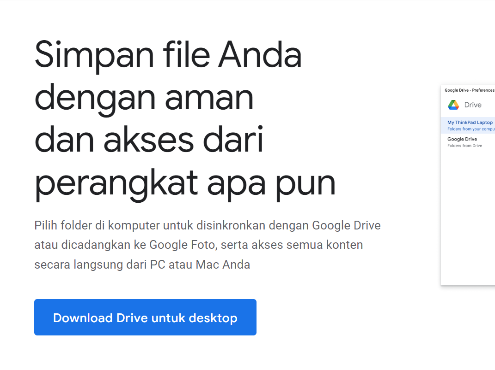
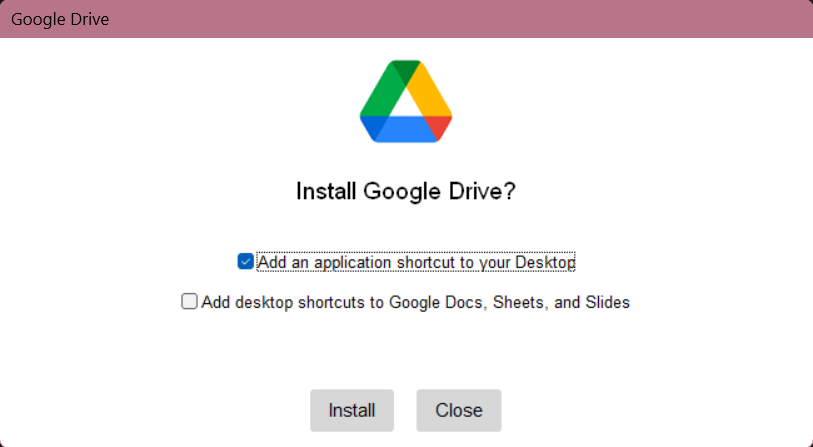
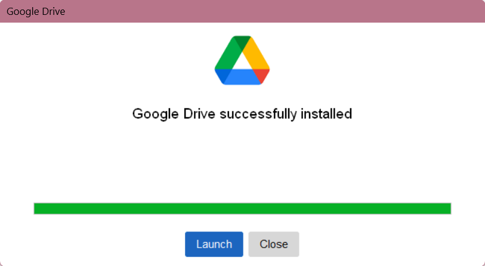
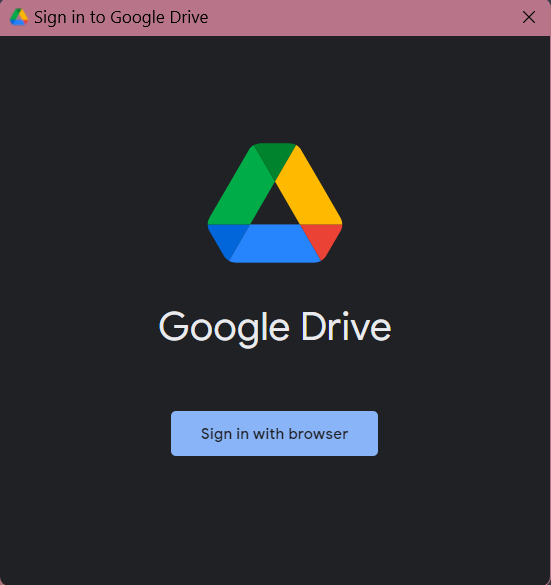
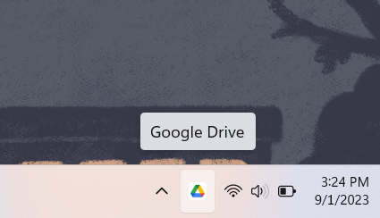
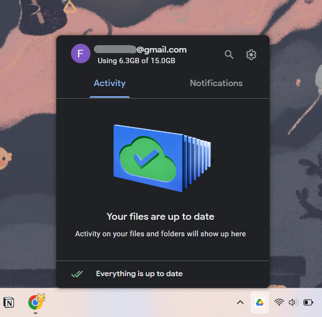
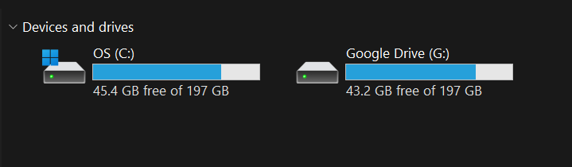
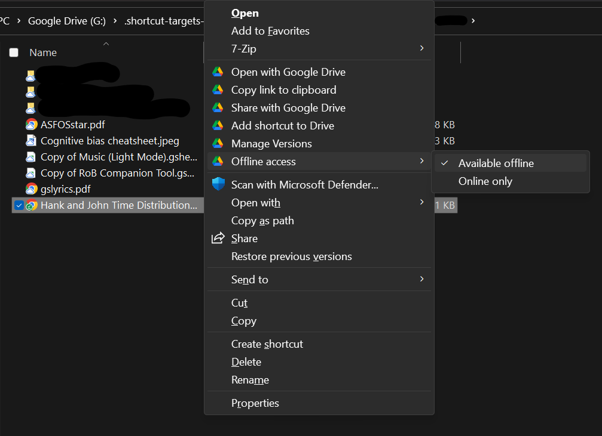

_Edit 1 September 2023 – Instruksi dan screenshot diperbarui sesuai dengan versi Google Drive terbaru._

[[#Menginstal Google Drive for Desktop|↓ Langsung ke tutorial]]

Saat ini makin banyak orang yang menggemari _cloud storage_ karena tidak makan tempat di _hard drive_ komputer, lebih mudah di-_share_ dan dikolaborasikan, serta menghindarkan dari musibah kehilangan file yang rawan terjadi jika hanya disimpan di komputer.

Tapi ketika mendengar, “Sekarang kan ada _cloud storage_. Kalau disimpan offline takut hilang, simpan saja di Google Drive,” yang kemudian terpikir adalah; _Repot amat, ya. Berarti setiap kali mengedit file, harus login ke Google Drive lalu mengunggah revisi terbaru itu. Bagaimana kalau saya tidak terbiasa mengingat untuk selalu back up ke Drive? Bagaimana kalau saya jadi punya dua file, online dan offline, dan jadi bingung mana file yang paling baru. Lalu untuk mengedit file itu, saya harus download lagi dari Drive, lalu upload lagi?_

Sekarang tidak perlu khawatir lupa _back up_ dan sebagainya, karena ada cara supaya kamu bisa mengakses file-file lewat File Explorer di komputer sama seperti cara mengakses file-file lokalmu, tapi bonusnya, file tersebut adalah file yang sama dengan file yang tersimpan di Google Drive. Google Drive for Desktop adalah aplikasi yang memberi kemudahan ini.

_==(Google Drive for Desktop hanya tersedia untuk Windows 10 atau yang lebih baru, dan macOS Catalina 10.15.7 atau yang lebih baru. Tutorial ini dibuat untuk pengguna Windows.)==_

### Menginstal Google Drive for Desktop

Kunjungi [google.com/drive/download/](https://google.com/drive/download/) menggunakan komputer atau laptop, dan klik tombol **Download Drive untuk desktop**.

<figure>
	
	<figcaption></figcaption>
</figure>

Tunggu hingga _installer_ selesai terdownload, kemudian buka file _GoogleDriveSetup.exe_ yang sudah terdownload dan ikuti perintah instalasi aplikasi.

<figure>
	
	<figcaption>klik <strong>Install</strong></figcaption>
</figure>

Jika Google Drive for Desktop sudah berhasil diinstal, klik tombol **Launch** dan akan muncul tombol untuk login.

<figure style="display:flex;gap:1em">
	

		
		<figcaption></figcaption>
	

	

		
		<figcaption></figcaption>
	

</figure>

Dengan mengeklik **Sign in with browser**, halaman login akan terbuka di browser default kamu.

<figure>
	
	<figcaption></figcaption>
</figure>

Login dengan email dan password akun Google Drive kamu, atau jika diperintahkan untuk memilih dari beberapa akun Google, pilih akun yang kamu gunakan untuk Google Drive. Setelah login berhasil, tutup browser yang baru saja digunakan untuk login. Dalam beberapa saat, akan muncul ikon Google Drive di taskbar.

<figure>
	
	<figcaption></figcaption>
</figure>

Dengan mengeklik ikon tersebut, kamu bisa melihat file-file yang terakhir kamu kerjakan, mencari file, dan mengubah setelan aplikasi Google Drive.

<figure>
	
	<figcaption></figcaption>
</figure>

Untuk mengubah setelan, klik ikon roda gigi ⚙️ di sudut kanan atas. Untuk mencari file yang ada di penyimpanan Google Drive, kamu bisa klik ikon kaca pembesar 🔍 di kanan atas. Namun, dengan cara ini file yang kamu cari nantinya akan terbuka di browser. Untuk membuka file Google Drive menggunakan aplikasi yang ada di komputermu, misalnya Microsoft Office atau Adobe Reader, kamu bisa gunakan File Explorer untuk mencari file.

Buka File Explorer seperti yang kamu lakukan jika ingin mencari file di komputer. Google Drive akan ditampilkan sebagai salah satu _storage_ bersama _hard drive_ dan _storage_ lainnya di komputer.

<figure>
	
	<figcaption></figcaption>
</figure>

Dalam keadaan online dan tersinkronisasi, kamu bisa membuka file-file dalam Google Drive secara langsung seperti membuka file-file lokal. Untuk file Microsoft Office, misalnya, file akan langsung terbuka di program Microsoft Office di komputermu, dan ketika kamu klik _Save_ atau menekan tombol `Ctrl+S`, editan yang baru saja kamu simpan akan langsung tersinkronisasi dengan Google Drive. Jadi, kalaupun kemudian kamu mengaksesnya lewat Google Drive di web browser, kamu akan mendapatkan versi yang baru saja diedit tersebut.

Kalau kamu mencoba membuka file dengan ekstensi _.gdoc, .gsheet_, dan file-file lain yang dibuat secara online dengan Google Docs, kamu akan dialihkan ke web browser dan file tersebut akan terbuka di Google Docs, dan bukan di program Office di komputer.

### Membuka file Google Drive saat offline

Jika tidak selalu memiliki akses internet, kamu bisa menyimpan file-file yang sedang kamu kerjakan saat ini secara offline sehingga bisa diakses kapan saja tanpa koneksi internet. Editan terbarumu yang tersimpan di komputer akan langsung tersinkronisasi ke Google Drive ketika komputermu terhubung dengan internet. Cara mengatur agar file dapat diakses secara offline (lakukan ini saat masih terhubung dengan internet) adalah dengan klik kanan file yang diinginkan, arahkan kursor ke menu **Offline access** (atau klik **More options** dulu jika menu belum tampil), lalu klik **Available Offline** sehingga tercentang. File yang tersimpan offline akan ditandai dengan centang hijau pada ikonnya.

<figure>
	
	<figcaption>Agar file dapat diakses tanpa koneksi internet: klik kanan pada file → <em>Offline access</em> → <em>Available offline</em></figcaption>
</figure>

Dengan menginstal Google Drive for Desktop, kamu tidak perlu membuka Google Drive di web browser lalu mengupload file setiap kali selesai mengedit.

Untuk menambahkan file baru, cukup _paste_ file ke dalam folder _My Drive_ atau sub-folder yang kamu punya. Kamu juga bisa membuat folder baru dengan cara yang sama seperti membuat folder lokal di komputer. Semuanya akan tersinkronisasi ke Google Drive asalkan terhubung dengan internet.

---

_Riwayat perubahan:_

_1 September 2023 – Instruksi dan screenshot diperbarui sesuai dengan versi Google Drive terbaru._

_9 Januari 2021 – Screenshot diperbarui sesuai tampilan Google Drive saat ini dengan bahasa antarmuka Bahasa Indonesia. Semoga tutorial ini bermanfaat buat teman-teman yang saat ini belajar atau bekerja dari rumah._

Posted on [December 7, 2018](https://fatiya.tech.blog/2018/12/07/backup-otomatis/)
