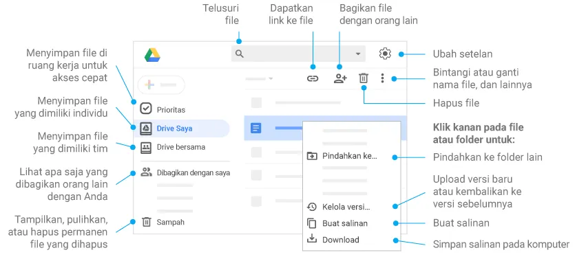

## Akses Google Drive

Buka [drive.google.com](http://drive.google.com) lalu login dengan akun Google, email kerja, atau SSO perusahaan.

<figure>
	
	<figcaption>Tampilan Google Drive</figcaption>
</figure>

Ada dua lokasi penyimpanan dalam Google Drive di Google Workspace:

1. Ruang penyimpanan pribadi di **My Drive (Drive Saya)**, yang juga tersedia di Google Drive umum, dan
2. Ruang penyimpanan bersama (yang dapat dipisahkan berdasarkan tim atau proyek) di **Shared Drives (Drive Bersama)** (khusus Google Workspace)

> [!important]+ Sangat dianjurkan
> Untuk memahami prinsip dasar Google Drive, luangkan waktu untuk mempelajari [Cara menggunakan Google Drive (Bahasa Indonesia)](https://support.google.com/drive/answer/2424384?hl=id&ref_topic=14940) dan [cara menggunakan Drive Bersama](https://support.google.com/a/users/answer/9310351?hl=id)

## Mengelola Dokumen di Google Drive

Ada dua set format dokumen *office* (teks-spreadsheet-presentasi) yang umum digunakan:

1. Microsoft Office — terdiri atas Word, Excel, PowerPoint
2. Google Docs — terdiri atas:
    - Google Docs [docs.google.com/document](http://docs.google.com/) (ekuivalen dengan Microsoft Word)
    - Google Sheets [docs.google.com/spreadsheets](http://docs.google.com/spreadsheets) (ekuivalen dengan Microsoft Excel)
    - Google Slides [docs.google.com/presentation](http://docs.google.com/presentation) (ekuivalen dengan Microsoft PowerPoint)

> [!info]
> Dokumen Google Docs nantinya dapat dikonversi menjadi dokumen Microsoft Office (.docx, .xlsx, .pptx). ([[#Cara mengelola file Google Docs|Lihat ↓]])

Google Docs dan Microsoft Office memiliki peruntukan yang berbeda. Untuk keperluan kolaborasi dan pembaharuan data secara *real-time*, Google Docs lebih cocok dipakai. Sedangkan untuk dokumen yang memerlukan formatting yang rumit, Microsoft Office lebih ahli.

### Membedakan file Microsoft Office (.docx, .xlsx, .pptx) dan file Google Docs (.gdoc, .gsheet, .gslides)

File Microsoft Office dapat berubah formatting-nya jika diedit menggunakan Google Docs. Karena itu perbedaannya perlu dikenali agar tahu cara mengelolanya.

Berikut adalah perbedaan file-file Google Docs dan Microsoft Office:

| **Microsoft Office**                                                                                                                                                                      | **Google Docs**                                                                                           |
| ----------------------------------------------------------------------------------------------------------------------------------------------------------------------------------------- | --------------------------------------------------------------------------------------------------------- |
| ![[Untitled 1.webp\|250]]                                                                                                                                                                 | ![[Untitled 2.webp\|250]]                                                                                 |
| Secara default, file Microsoft Office jika diupload ke Google Drive akan mempertahankan ekstensi (.docx, .xlsx, .pptx) dalam nama filenya, contoh: *Panduan.docx* atau *Perhitungan.xlsx* | File-file Google Docs bisa langsung dibaca dan diedit di web browser oleh siapa saja yang memiliki akses. |

%%
**Microsoft Office**

<figure>
	
	<figcaption>Ikon Microsoft Office</figcaption>
</figure>

Secara default, file Microsoft Office jika diupload ke Google Drive akan mempertahankan ekstensi (.docx, .xlsx, .pptx) dalam nama filenya, contoh: *Panduan.docx* atau *Perhitungan.xlsx*

**Google Docs**

<figure>
	
	<figcaption>Ikon Google Docs</figcaption>
</figure>

File-file Google Docs bisa langsung dibaca dan diedit di web browser oleh siapa saja yang memiliki akses.

%%
### Cara mengelola file Microsoft Office

Ada tiga cara untuk mengedit file Microsoft Office yang tersimpan dalam Google Drive agar file tersebut selalu tersimpan sebagai versi terbaru.

[[#Fitur Version Management|Version Management]] ▪ [[#Google Drive for Desktop]] ▪ [[#Cara mengelola file Google Docs|Google Docs]]

#### Fitur Version Management

Dengan fitur ini kita dapat memperbarui file Microsoft Office yang tersimpan dalam Google Drive dengan cara meng-upload file yang sudah diedit/diperbarui untuk mengganti file sebelumnya. Fitur ini hanya membutuhkan web browser dan software Office yang biasanya sudah terpasang di semua komputer. Fitur ini sangat membantu bagi komputer yang tidak didukung Google Drive for Desktop atau jika kita sedang menggunakan komputer lain untuk mengakses akun Google.

Berikut langkah-langkahnya:

1. Download file yang akan diperbarui tersebut sehingga dapat dibuka dengan software Office di komputer
2. Edit dan simpan file seperti biasa. Nama dan format file tidak perlu sama persis dengan sebelumnya. Jika perlu, dapat ditambah inisial atau nomor versi.
3. Dalam web browser, buka folder Google Drive yang berisi file yang akan diperbarui
4. Klik kanan file yang akan diperbarui kemudian klik **Manage versions**
5. Klik tombol **`UPLOAD NEW VERSION`** lalu pilih file yang sudah diedit. Klik tombol **Open** untuk meng-upload file tersebut.
6. Selesai. File yang tersimpan dalam Google Drive kini sudah tergantikan dengan versi yang baru.

>[!info]+
>Perbedaan fitur ini dengan cara manual (upload file baru – hapus file lama) adalah file yang lama masih tersimpan dan dapat di-download maupun di-restore sebagai versi aktif, namun tidak membingungkan pengguna yang mencari versi aktif file tersebut.

#### Google Drive for Desktop

Google Drive for Desktop memungkinkan kita untuk mengelola file-file Google Drive melalui file explorer seolah file tersebut merupakan file lokal di komputer.

>[!tip]
>
[[Google Drive for Desktop|Pelajari cara menginstal dan menggunakan Google Drive for Desktop]]

%%>[Pelajari cara menginstal dan menggunakan Google Drive for Desktop](https://support.google.com/a/users/answer/9967896)%%

#### Edit di browser menggunakan Google Docs

Jika file tidak menggunakan format yang rumit (mengandung tabel, gambar, kop surat, *style* dan layout teks dan paragraf yang sudah terstruktur di Microsoft Office) maka pengeditan singkat boleh dilakukan langsung di browser.

Di Google Drive, klik dua kali file Office. File akan terbuka di Google Dokumen, Spreadsheet, atau Slide. Jika terbuka dalam mode preview (tidak bisa diedit) maka klik **`Buka dengan`** lalu pilih aplikasi ekuivalennya ([[#Membedakan file Microsoft Office (.docx, .xlsx, .pptx) dan file Google Docs (.gdoc, .gsheet, .gslides)|Lihat ↑]]). Setiap editan akan otomatis tersimpan dalam hitungan detik (lihat status di panel atas) di file office tersebut.

### Cara mengelola file Google Docs

File Google Docs dapat diedit langsung di browser oleh satu orang maupun beberapa orang secara bersamaan.

Di Google Drive, klik dua kali file Google Docs. File akan terbuka di Google Dokumen, Spreadsheet, atau Slide. Jika terbuka dalam mode preview (tidak bisa diedit) maka klik **`Buka dengan`** lalu pilih aplikasi yang sesuai. Setiap perubahan akan otomatis tersimpan.

>[!tip]+
>Cara [mendownload, mencetak, atau mengirimkan file Google Docs sebagai file Office](https://support.google.com/a/users/answer/9306091?hl=id)

Baca juga [[Google Drive for Desktop|cara mem-backup file secara otomatis dari komputer ke Google Drive]].
