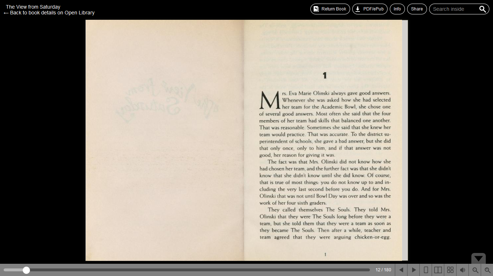
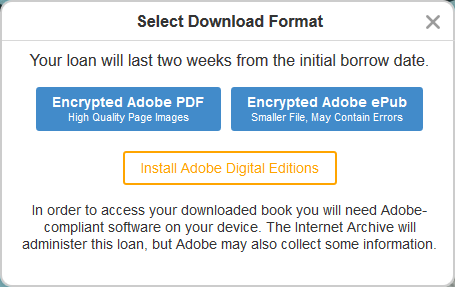

# Read your borrowed e-books offline

So you have found the book you want to read and you just borrowed them from [openlibrary.org](https://href.li/?http://openlibrary.org). Now you are reading it online in your browser, because **Read Online** is the only button you see aside from **Return Book**. But you want to be able to continue reading when you are no longer connected to the internet. You actually can. There’s just a few more step–or a lot, but the many steps are just the first-time set up and you won’t have to repeat the hassle every time you borrow a new book please don’t close this page yet–

… you stayin? Thank you. Okay, let’s start.

So now you are on this screen.

<figure>
	
	<figcaption>Internet Archive BookReader</figcaption>
</figure>

You should see a **download PDF/ePub** button on the top bar. When you click that, you will see the button to download the encrypted PDF of the book and another button to download the encrypted ePub file. But it will not give you the PDF or ePub file right away. This is where you need Adobe Digital Editions.

<figure>
	
	<figcaption></figcaption>
</figure>

### Installing Adobe Digital Editions

1. You can click the **Install Adobe Digital Editions** button, or you can follow [this link](https://href.li/?https://www.adobe.com/solutions/ebook/digital-editions/download.html) to go to the download page.
2. Click the download link according to your operating system. The installer file will be downloaded to your computer.
3. Double click the installer and follow the instruction to run the installation.
4. That’s it! Now you have Adobe Digital Editions up and running, and you can use it forever to read your borrowed books and any e-books you own.

### Opening borrowed books in Adobe Digital Editions

1. Select the e-book format you want to download. PDF usually gives you a high quality image of the page but it will have bigger file size and I personally don’t enjoy reading in this format because I like flowing text better. ePub provides flowing text that makes it easier to modify text size and columns, but since it was extracted from scanned pages, it may contain mistakes. Your call. (I usually go with the ePub format since for me the flowing text is worth the very few mistakes.)
2. When you click your choice, a file named _URLLink.acsm_ will be downloaded to your computer. Open the file and Adobe Digital Editions will be prompted to download the book.
3. In just a few seconds you should see your book opened in Adobe Digital Editions. Happy reading!

By the way, since your borrowed books have due dates, it will expire and no longer accessible on its due date. If you want to return the book before due, go to the **Borrowed** bookshelf in Adobe Digital Edition, right-click on the book that you want to return, and click **Return Borrowed Item**.

فتي

Posted on [December 3, 2018](https://fatiya.tech.blog/2018/12/03/read-borrowed-books-offline/)
